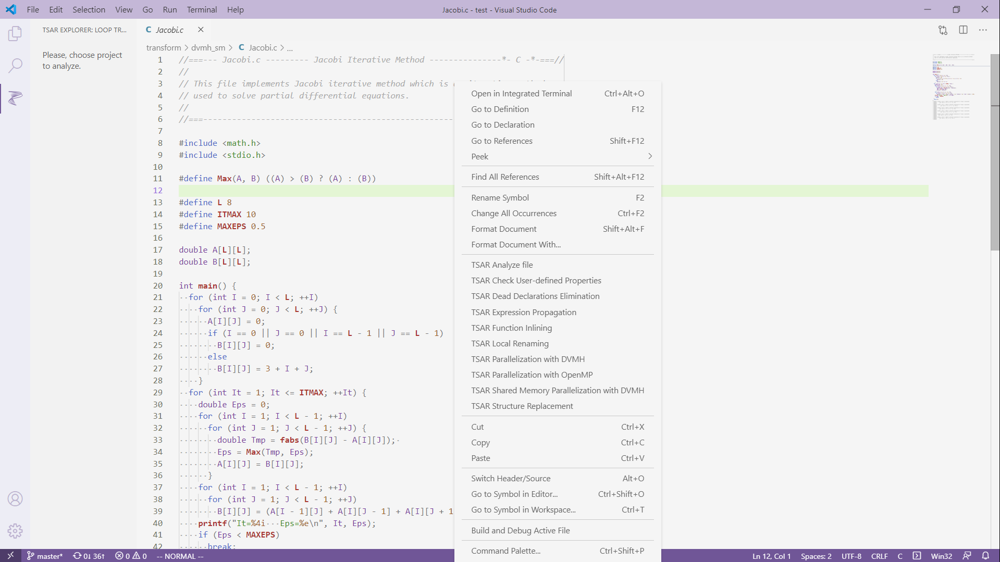
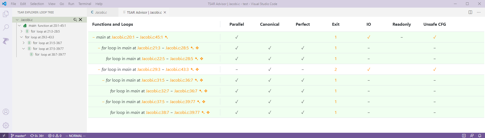

# TSAR Advisor

This extension proposes some useful information about a program to simplify its parallelization.
It also provides some useful source-to-source transformations for programs as well as automates their parallelization.
The advisor currently supports C/C++ languages and based on LLVM & Clang projects.

> __Attention.__ To run the adviser the TSAR tool must be installed. It must be available in the system PATH or the path to `tsar-server` executable must be configured manually (see `Analysis Server` configuration variable for details). Details about the TSAR tool can be found in [TSAR Wiki](https://github.com/dvm-system/tsar/wiki).

Use the context menu or type one of the available TSAR commands in the Command Palette.

If `TSAR: Analyse file` action is used the summary of discovered traits is rendered in the new tab.

Loops that could be parallelized are marked with green. A detailed description of accessed memory is available for each loop.

You may also choose a function to view its callgraph.

If some transformation is requested, the original file is changed on success. Some diagnostic messages may be also provided.

